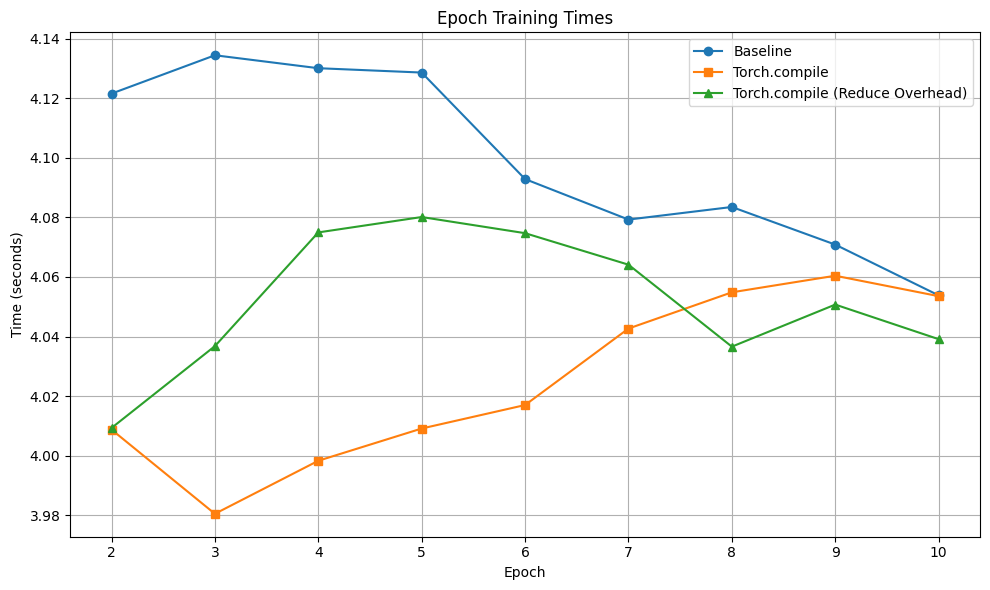

# Optimizing ChemBERTa with Parameter-Efficient Techniques for Molecular Toxicity Prediction

[](https://wandb.ai/hpml-proj-deepchem/chemberta)

## Introduction

**ChemBERTa** is a domain-specific BERT model pre-trained on 10 million SMILES strings from the ZINC15 database. Developed by [Chithrananda et al.](https://arxiv.org/abs/2010.09885), it achieves state-of-the-art performance on chemical property prediction tasks. This project optimizes ChemBERTa for the ClinTox toxicity prediction task using parameter-efficient techniques.


**Key Techniques Applied:**
- **LoRA/AdaLoRA**: Low-Rank Adaptation for efficient fine-tuning
- **Quantization**: Post-Training Quantization (PTQ) for model compression
- **torch.compile**: Graph optimizations for faster inference
- **KD-LoRA**: Knowledge Distillation to smaller LoRA-adapted models

## Project Structure

```
deepchem-model-optimization/
├── chemberta_lora_adalora.ipynb # LoRA and AdaLoRA adapted ChemBERTa with hyperparameter tuning
├── KDLoRA.ipynb # Knowledge Distillation + LoRA implementation
├── Quantized_LoRA.ipynb # PTQ experiments + LoRA
├── Compiled_LoRA.ipynb # Optimized vs base LoRA model speeds
├── prototype/ # initial mini experiments
├── images/ # images for metric data visualizations
└── README.md
```


### Executing the Code
The notebooks are all self contained and can be run on Google Colab using a GPU runtime.

**Note:** You might not be able to view some of the Jupyter notebooks directly on the GitHub page due to GitHub’s rendering limitations. For the best experience, please download the notebooks and open them locally.

### Viewing the Project Locally

```
git clone https://github.com/ab4972/DeepChem-Model-Optimization.git
```

### WandB 

Full [Weights and Biases](https://wandb.ai/site/) integration for experiment tracking.

To replicate:
```
pip install wandb
wandb login [your-api-key] # Get key from https://wandb.ai/authorize
```


## Results

### **ChemBERTa fine tuning with LoRA variants:**

Best learning rate: 3e-4

Base model accuracy with no fine-tuning: 50.68%

| Model                   | Test Accuracy (%)   | Training Time (s) | Training Params |
|-------------------------|-----------------|-----------------|-----------------|
| Baseline w/ Fine-Tuning | 98.66     | 27.84     | 44845060     |
| LoRA                    | 97.97     | 21.56     | 739586     |
| AdALoRA                 | 97.97     | 32.09     | 1606335     |


### **ChemBERTa with Torch.Compile:**

| Model                   | Test Accuracy (%)   | Training Time (s) |
|-------------------------|-----------------|-----------------|
| Baseline LoRA Model | 97.97     | 43.70     | 
| Torch.Compile                    | 98.65     | 42.88     |
| Torch.Compile Reduced-Overhead Mode     | 98.65     | 46.29     |




### **ChemBERTa with Quantization:**

| Model                   | Test Accuracy (%)   | Model Size (MB) | Inference Time (s) |
|-------------------------|-----------------|-----------------|------------|
| Baseline ONNX | 98.65 | 169.02 |  5.79 | 
| Quantized ONNX | 98.65 | 42.75 | 1.74 | 


### **ChemBERTa with KD-LoRA:**

| Model                   | Test Accuracy (%)   | Total Params | Model Size (MB) |
|-------------------------|-----------------|-----------------|------------|
| Teacher Model| 98.65 | 44104705 |  168.25 | 
| Student Model| 95.95 | 30667778 | 116.99 | 


---

**Contributors** [Adam Banees](https://github.com/ab4972), [Shriya Kalakata](https://github.com/shriyakalakata), [Twinkle Gupta](https://github.com/twinklegupta013)

